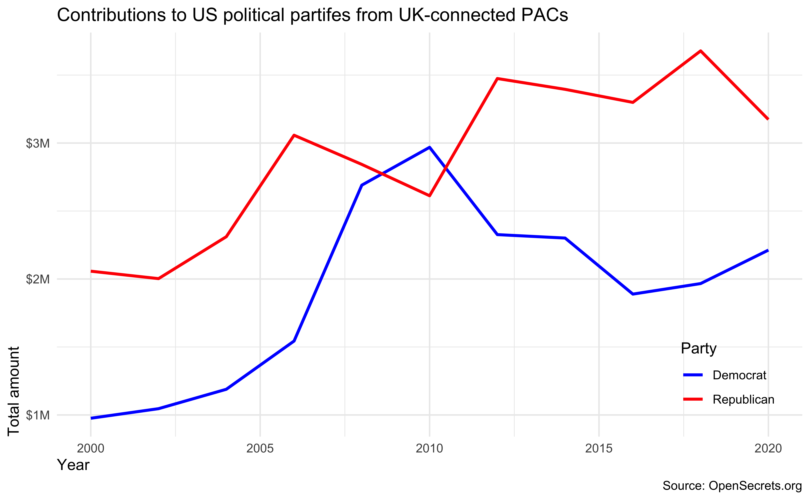
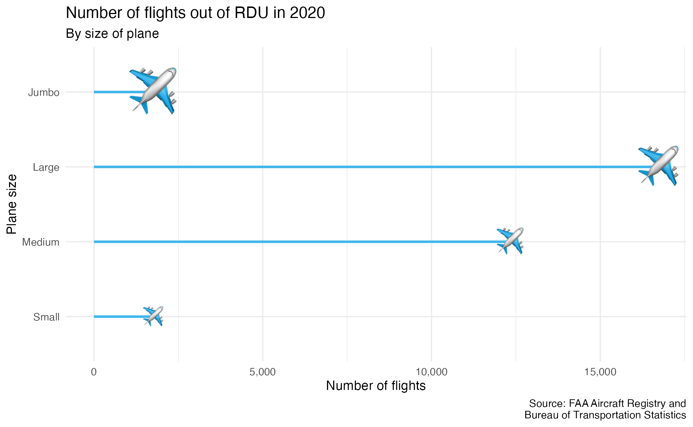

# homework-02

For any exercise where you’re writing code, insert a code chunk and make
sure to label the chunk. Use a short and informative label. For any
exercise where you’re creating a plot, make sure to label all axes,
legends, etc. and give it an informative title. For any exercise where
you’re including a description and/or interpretation, use full
sentences. Make a commit at least after finishing each exercise, or
better yet, more frequently. Push your work regularly to GitHub. Once
you’re done, inspect your GitHub repo to make sure it has all the
components you want to submit in the `homework-02.md` file, including the
prose, the code, and all plots.

1.  **A new day, a new plot, a new geom.** The goal of this exercise is
    to learn about a new type of plot (ridgeline plot) and to learn how
    to make it.

    Use the `geom_density_ridges()` function from the **ggridges**
    package to make a ridge plot of of Airbnb review scores of Edinburgh
    neighborhoods. The neighborhoods should be ordered by their median
    review scores. The data can be found in the **dsbox** package, and
    it’s called `edibnb`.

    *(Note:* This is not a geom we introduced in class, so seeing an
    example of it in action will be helpful. Read the package README at
    <https://wilkelab.org/ggridges> and/or the introduction vignette at
    <https://wilkelab.org/ggridges/articles/introduction.html>. There is
    more information than you need for this question in the vignette;
    the first section on Geoms should be sufficient to help you get
    started.)

2.  **Key lyme pie.** The goal of this exercise is to recreate a pie
    chart in R and then improve it by presenting the same information as
    a bar graph. The pie chart to be recreate is below and it comes from
    the Lyme Disease Association. (Source:
    [https://lymediseaseassociation.org/resources/2018-reported-lyme-cases-top-15-states](https://lymediseaseassociation.org/resources/2018-reported-lyme-cases-top-15-states/).)

    

    Below are the steps I recommend you follow and some guidance on what
    (not) to worry about:

    -   First, create the data frame: Use the annotations in the
        visualization provided to do this. You should create the new
        data frame using the `tibble()` or the `tribble()` functions.

    -   Then, recreate the pie chart: When recreating the pie chart you
        do not need to

        -   make it a 3D pie chart (2D is sufficient)
        -   match the colors (default ggplot2 colors or any other color
            palette is fine)
        -   annotate the plot in the same way (just the legend is
            sufficient)
        -   match the entire caption (see below for what we want you to
            match)

        However you should,

        -   make a 2D pie chart
        -   present a legend on the right that shows the mapping of the
            colors to states
        -   match the title text, location, and alignment
        -   match the text, location, and alignment of the first two
            lines of the caption

    -   Finally, improve the visualization by presenting this
        information in the form of a bar graph. And as an additional
        challenge, imagine you’re working for the state of Connecticut,
        so highlight that bar corresponding to that state in some way.
        Write a sentence or two describing

3.  **Foreign Connected PACs.** Only American citizens (and immigrants
    with green cards) can contribute to federal politics, but the
    American divisions of foreign companies can form political action
    committees (PACs) and collect contributions from their American
    employees. (Source:
    <https://www.opensecrets.org/political-action-committees-pacs/foreign-connected-pacs/2020>).

    In this exercise you will work with data from contributions to US
    political parties from foreign-connected PACs. The data is stored in
    CSV files in the `data` directory of your repository/project. There
    are 11 files, each for an election cycle between 2000 and 2020. You
    can load all of the data at once using the code below.

    ``` r
    # get a list of files with "Foreign Connected PAC" in their names
    list_of_files <- dir_ls(path = "data", regexp = "Foreign Connected PAC")

    # read all files and row bind them
    # keeping track of the file name in a new column called year
    pac <- read_csv(list_of_files, id = "year")
    ```

    The ultimate goal of this exercise is to recreate yet another plot.
    But there is a nontrivial amount of data wrangling and tidying that
    needs to happen before you can do that. Below are the steps you
    should follow so that you can obtain the necessary interim objects
    we will be looking for as we review your work.

    -   First, clean the names of the variables in the dataset with a
        new function from the
        [**janitor**](http://sfirke.github.io/janitor/) package:
        [`clean_names()`](http://sfirke.github.io/janitor/reference/clean_names.html).
        Then clean and transform the data such that you have something
        like the following at the end.

            ## # A tibble: 2,184 × 6
            ##     year pac_name_affiliate        country_of_orig… parent_company   dems repubs
            ##    <int> <chr>                     <chr>            <chr>           <dbl>  <dbl>
            ##  1  2000 7-Eleven                  Japan            Ito-Yokado       1500   7000
            ##  2  2000 ABB Group                 Switzerland      Asea Brown Bov… 17000  28500
            ##  3  2000 Accenture                 UK               Accenture plc   23000  52984
            ##  4  2000 ACE INA                   UK               ACE Group       12500  26000
            ##  5  2000 Acuson Corp (Siemens AG)  Germany          Siemens AG       2000      0
            ##  6  2000 Adtranz (DaimlerChrysler) Germany          DaimlerChrysle… 10000    500
            ##  7  2000 AE Staley Manufacturing … UK               Tate & Lyle     10000  14000
            ##  8  2000 AEGON USA (AEGON NV)      Netherlands      Aegon NV        10500  47750
            ##  9  2000 AIM Management Group      UK               AMVESCAP        10000  15000
            ## 10  2000 Air Liquide America       France           L'Air Liquide …     0      0
            ## # … with 2,174 more rows

    -   Then, pivot the data longer such that instead of `dems` and
        `repubs` columns you have a column called `party` with levels
        `Democrat` and `Republican` and another column called `amount`
        that contains the amount of contribution.

    -   Then, For each election cycle (`year`) calculate the total
        amount of contributions to Democrat and Republican parties from
        PACs with `country_of_origin` UK. The resulting summary table
        should have two rows for each year of data, one for Democrat and
        one for Republican contributions.

    -   Then, recreate the following visualization.

        

    -   Finally, remake the same visualization, but for a different
        country. I recommend you choose a country with a substantial
        number of contributions to US politics. Interpret the new
        visualization that you make.

4.  **Hop on.** We have two datasets we’ll work with in this exercise:

    -   `data/rdu-flights-2020.csv`: All flights out of RDU
        (Raleigh-Durham airport) in 2020.

    -   `data/rdu-planes-2020.csv`: Plane metadata for plane tailnumbers
        found in the FAA aircraft registry in 2020.

    The tasks for this question are outlined below:

    -   Load the datasets and then join them such that each row is a
        flight out of RDU. Use `tailnum` as the unique identifier to
        join by. The resulting dataset should contain flights with
        `tailnum`s that exist in both datasets and should be named
        `rdu_flights_planes`. Then, report the number of rows and
        columns in `rdu_flights_planes`. (*Note:* It’s possible that not
        all flights in `rdu-flights-2020.csv` have a corresponding plane
        in `rdu-planes-2020.csv`.)

    -   Create a new variable called `size` that categorizes the planes
        into four: small, medium, large, and jumbo. You can do this
        based on any information in the data that makes sense to you to
        use, but you should explain your reasoning and justify the
        cutoffs you use (with citations and/or additional visualizations
        of other variables in the data).

    -   Create a visualization like the one below. Note that the size of
        the airplane emoji increases with plane size. The data presented
        in your plot will most likely look different than mine because
        you might use different criteria to determine `size` of the
        plane, and that’s ok! And the sizes of the plane emojis may not
        be the same either as it’s difficult (if not impossible) to tell
        from the plot what font sizes I used. Just match the general
        look and layout of the plot. (*Note:* Since ultimately you’ll be
        displaying an emoji in a plot in an R Markdown document, you
        need to add the following chunk option to the chunk where you
        make this plot: `dev = "ragg_png"`. Otherwise the emojis will
        not show up (or will show up as empty rectangles) when you knit
        your document. If you’re interested in learning more about
        modern text features in R, I recommend the following blog post:
        [https://www.tidyverse.org/blog/2021/02/modern-text-features](https://www.tidyverse.org/blog/2021/02/modern-text-features/).)

        

    -   Time to get creative! Create another plot that displays some
        flight patterns in 2020. Your plot should be based on the joined
        `rdu_flights_planes` dataset and the new variable you created,
        `size`, must be one of the variables you represented. You’re
        free to choose any other variables you want for your plot. Along
        with your plot, provide an interpretation.

5.  **Expect More. Plot More.** Make the following image (it’s the logo
    for the retail store [Target](https://www.target.com/)) using
    ggplot2. Write a few sentences describing your approach.

    

    Some tips:

    -   I didn’t give you a dataset to plot, you’ll need to make one.
        Use `tibble()` or `tribble()` to do that again. It really
        doesn’t matter what you choose to include in that dataset as
        long as you achieve the final look.

    -   The red used in the plot is the “Target red”, you can google and
        find out what that is. Don’t forget to cite your source for this
        too!

    -   The registered trademark symbol (R in a circle) can be a bit
        trickier to figure out. There is a only a very small number of
        points associated with that component of the plot. So think of
        it as a “stretch goal” and work on figuring out the rest of the
        plot first.

    -   The aspect ratio of of your plot in your R Markdown document is
        just as important as the plot. Once you figure out the code to
        make the plot, knit your document to make sure it looks good in
        the output of your R Markdown document.

    -   There are many ways you can do this, feel free to discuss with
        classmates but fight the urge to adopt their approach. Instead,
        try to come up with your unique one.
